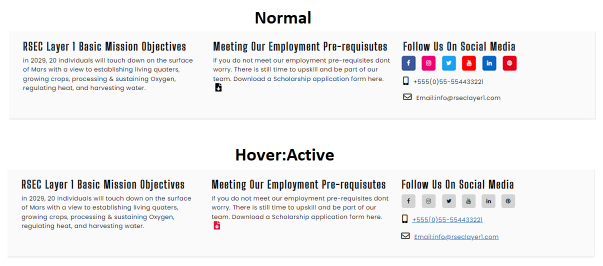

# Milestone Project 01 

### Red Zone | Mission to Mars

## Table of contents
1. [Responsive Design](#responsive_design)
2. [My Project Description and Design](#project_description)
    1. [Main Page](#main_page)
    2. [We Need You](#we_need_you)
    3. [About Us](#about_us)
    4. [Gallery](#gallery)
    5. [Nav-Bar](#nav-bar)
    6. [Join Our Team](#join_our_team)
    7. [Footer](#footer)
3. [Utilising the 5 Planes of UX Design](#ux_design)
    1. [The Strategy Plane](#strategy_plane)
    2. [The Scope Plane](#scope_plane)
    3. [The Structure Plane](#structure_plane)
    4. [The Skeleton Plane](#skeleton_plane)
    5. [The Surface Plane](#surface_plane)
4. [Typography](#typography)
5. [User Stories](#user_stories)
    1. [External User's Goal](#external_user_goal)
    2. [Site Owner's Goal](#site_owner_goal)
    3. [First Time User Goals](#first_time_user_goals)
    4. [Returning User Goals](#returning_user_goals)
    5. [Frequent User Goals](#frequent_user_goals)
6. [References and Credits Section](#references_and_credits)
    1. [Code](#code)
    2. [Media](#media)
    3. [Fictional Application Form](#fictional_application_form)
    4. [Contact](#contact)
7. [Testing](#testing)
    1. [Website Functionality Testing Procedure Tables](#testing_procedure)
    2. [HTML and CSS Validation](#validation)
8. [Creation of Template and Deployment of Project](#project_deployment)
    1. [Creating a New Project](#new_project)
    2. [Commands Utilised Throughout The Project After Changes](#commands)
    3. [How to Deploy My Milestone\_Project\_01 on GitHub Pages](#how_to_deploy)
    4. [How to Download, View and Edit This Project Locally using Notepad++](#how_to_download)
9. [Acknowledgements](#acknowledgements)
  

## Responsive Design 

As seen in the picture above, you can view the projects 4 pages responsiveness to different device sizes at “ami.responsivedesigns.is” 
by clicking the following:

[index.html Responsiveness](http://ami.responsivedesign.is/?url=https%3A%2F%2Fferdosull.github.io%2FMilestone_Project_01%2Findex.html)

[about.html Responsiveness](http://ami.responsivedesign.is/?url=https%3A%2F%2Fferdosull.github.io%2FMilestone_Project_01%2Fabout.html)

[gallery.html Responsiveness](http://ami.responsivedesign.is/?url=https%3A%2F%2Fferdosull.github.io%2FMilestone_Project_01%2Fgallery.html)

[weneedyou.html Responsiveness](http://ami.responsivedesign.is/?url=https%3A%2F%2Fferdosull.github.io%2FMilestone_Project_01%2Fweneedyou.html)

View the live project here:[ RED ZONE M2M ](https://ferdosull.github.io/Milestone_Project_01/index.html)

My Milestone Project was envisioned and created based on the knowledge gained from the course leading up to this point. As well as the course materials, there have been some additions which I have found online and utilised. These additions have been highlighted and referenced later on in this document (references and credits section). 

## My Project Description and Design 

For my first Milestone Project I have developed a futuristic recruitment type website for a fictional Space Exploration Company called RSEC (Red Zone Space Exploration Company). The goal of the website is to inform potential candidates of the launch date for the first colony on Mars, provide an about page detailing previous accolades, detail what the pre-requisites are if candidates or students wish to apply to be part of the team (contained in the “Join Our Team modal”), the type of sectors requiring candidates (the “We Need You” page) and in the gallery section, display some photos of the RSEC catalogue. In the footer there is the possibility to download a scholarship application form for students who may not currently meet the pre-requisite requirements accompanied by social media links and contact details. The website is made up of 4 pages:[ index.html,](https://ferdosull.github.io/Milestone_Project_01/index.html)[ about.html,](https://ferdosull.github.io/Milestone_Project_01/about.html) [gallery.html ](https://ferdosull.github.io/Milestone_Project_01/gallery.html)&[ weneedyou.html.](https://ferdosull.github.io/Milestone_Project_01/weneedyou.html) Please see wireframe screenshots below: 

**Main Page** 

The main page is very minimalistic. Atop the page is a full width Nav-Bar which is shared on all pages. The Nav-Bar will be detailed at the end of this section. There is a large full screen high resolution image of Mars with the title “RED ZONE | MISSION TO MARS”. Immediately underneath the heading is a sub heading with the text “Countdown to Take Off” and immediately underneath this is a countdown timer with the end date of 05/01/2029 and beginning with the text “T-minus”. This I feel keeps the main page really in line with the Aerospace theme I am going for. Both the main heading and the sub-heading have a 2 second fade-in which I feel displays well as the countdown timer takes a second or so to display while doing its calculation. At the bottom of the page is a three-division footer which details some about text, a Download application or scholarship form and links to social media related websites. The Footer will also be detailed at the end of this section. 

**We Need You (Careers)** 

The “We Need You” page provides insights into the four sectors that require additional engineering staff in preparation for the mission launch in 2029. The sectors are divided into the following groupings of skillets: Advanced Medical, Information Technology, Agricultural Science and Engineering Science. 

In desktop format, if the pictures are hovered over, a description of the image can be seen with white text and on opaque background. On mobile, the same text description is always present. This was achieved by using “Min” & “Max” width media queries. Clicking on the image on both desktop and mobile will open the image in its own browser page. 

To the right of each case study is a “Join Our Team” button if the user feels that they hit the target requirements for that section, they press this button and a user input form (modal) pops up. The dropdown input field will be already be populated for the sector that the candidate is applying for. 

The Nav-Bar and Footer here are identical to the main page also. 

**About us** 

The “About Us” page displays the company logo in the top left column. The company logo was created using a free logo creator on the following website:[ Brand Crowd ](https://www.brandcrowd.com/maker/tag/free?code=25offsem&sem_ab=true&gclid=CjwKCAiArbv_BRA8EiwAYGs23IQTzXxcSC2m5vKdu3MSsOoz-ec-edyJeESBas_P0vYz0VGaT-PpGRoCqLcQAvD_BwE)

The image was styled further and resized by me using Photoshop. 

The CEO’s picture was taken from[ UnSplash ](https://unsplash.com/)and is placed in the top right corner and underneath, a small write up on the CEO’s previous accomplishments plus the amount of time they are active with The Red Zone Space Exploration Co. The picture used for the CEO is credited to the photographer in the credits section. In the write-up underneath the CEO’s picture are two “blue” links taking you to the home pages of both Universities that the CEO previously studied at. These web links are opened in a new browser window. 

The middle column of the page contains a writeup on the company spanning how their existence came to be, right up to how the current mission received funding and was made possible. There is a reference to one other Aerospace company (NASA) throughout the middle column. The first reference also has “blue” links taking you to their home page in a new browser window.  

The Nav-Bar and Footer here are identical to the main page also. 

**Gallery** 

The Gallery page contains photos of the RSEC catalogue which documents RSEC space machinery, testing phases, prototypes, experiments and shuttle launches. By clicking on each picture it will load it in its own browser page. Again, keeping in with the same style as the “We Need You Page”, in desktop format, if the pictures are hovered over, a description of the image can be seen with white text on an opaque background. On mobile, the same text description is always present. This was achieved by using “Min” & “Max” width media queries.  

The Nav-Bar and Footer here are identical to the main page also. 

**Nav-Bar** 

**Join Our Team Modal** 

**Footer** 

https://imagecolorpicker.com/en/

## Utilising the 5 Planes of UX Design 

**The Strategy Plane** 

The strategy plane, as mentioned previously, is concerned with trying to attract professionals on behalf of RSEC (Red Zone Space Exploration Co.) within the Aerospace industry to sign up for the first colony the live on Mars. I aim to achieve this by promoting the company in the about section, providing example skill sets case studies and having quotes from current employees who are preparing for the mission also. Previous mission pictures can be viewed in the gallery section also. 

**The Scope Plane** 

To Be Completed yet. 

**The Structure Plane** 

The website will consist of 4 pages, each with heading and footer continuity throughout.  The 4 pages are: 

A “Main” page, an “About Us” page, A “We Need You Page” and a “Picture Gallery” page. 

There is room to improve with additions but with the time that was allowed I am quite happy with the result. Based on what we have covered in the course work you could say that the project is in an “MVP” state. 

The navigation bar will be at the top of all pages and have a dark background. The Bootstrap class “navbar-dark” is being utilised here. 

Links will change style on hover as is standard with the bootstrap navbar class. This subtle animation lets the user know that they can click it to navigate to the location described by text or for more content. 

The links that lead to external content like the application form and social media pages will open on a new tab. The user will not lose the page that they were on before clicking the link. 

**The Skeleton Plane** 

To Be Completed yet. 

**The Surface Plane** 

My inspiration for the overall look and feel of the project comes from various Sci-Fi outlets (films/games) but the main colour scheme is based around the colour red as in “Mars the Red Planet”. 

The initial red and rest of the palette colour scheme was derived with[ www.coolors.com ](http://www.coolors.com/)

The Red I chose (#A72608) I felt was easy on the eye and not too bright or too dark. The rest of the palette was derived and locked in based on accenting and I feel the colours chosen work well with each other. The black and darker colours may not seem like a good choice but I feel they represent space very well and during my research it was noted that a lot of space related websites do also utilise black a lot, most notably:[ www.nasa.gov ](http://www.nasa.gov/)

Hovering over links, or on the application form, causes the buttons or icons to change colour alerting the user to the presence of their mouse pointer. For the social media icons, I used a light grey colour when active. Once the mouse pointer hovers over the icon the background colour changes from the colour associated with the social media outlet, to light grey. 

## Typography 

The fonts used for the milestone project are: “Poppins”, “Big Shoulders Stencil Text” and “Jet Brains Mono”. 

All three fonts were located and used from the website:[ https://fonts.google.com/ ](https://fonts.google.com/)

They appear futuristic and I feel that they fit in well with the space theme I am going for. I don’t think they would look out of place as a decal or a logo on the side of a space shuttle. Throughout the project I have made subtle changes to the font sizes and spacings as can be seen in the style.css sheet. 

## User stories 

**External user’s goal:** 

The site's users are academic professionals and students between the ages of 18 and 30, who wish to be part of the first colony on Mars. 

**Site owner's goal:** 

The Red Zone Space Exploration Company are interested in finding the right individuals who will be capable of providing and sustaining an environment on Mars to ensure survival of the human race. Not an easy task. 

**First Time User Goals** 

- As a First Time User, I want to understand the missions objectives and see does my skillsets fit the Red Zone Space Exploration Co.’s pre-requisites. 
- As a First Time User, I want to understand what the company is looking for and apply for a scholarship  
- As a First Time User, I want to find out when exactly the launch date for this mission is and what missions the company have successfully completed previously. 

**Returning User Goals** 

- As a Returning User, I want to log in and see how my assessment is progressing. Have I been successful with my application. 
- As a Returning User, I want to find contact info so that I can call or email the company directly. 

**Frequent User Goals** 

- As a Returning User, I want to log in and see how my assessment is progressing. Have I been successful with my application. 
- As a Frequent User, I want to view information on how the mission preparation is progressing. 
- As a Frequent User, I want to call or email the company directly. 

## References and Credits Section 

**Code:** 

The code for the countdown timer on the main page was found in the following location[:https://www.w3schools.com/howto/howto_js_countdown.asp ](https://www.w3schools.com/howto/howto_js_countdown.asp)

The countdown timer was further styled to include a custom font and font size plus an opaque background. 

**Media** 

The photos used to create the gallery were taken from the following location: [https://unsplash.com/ ](https://unsplash.com/)

Please see list of credits below for each photo: 

* bill-jelen-xb58P14hThc-unsplash – Photo by[ Bill Jelen ](https://unsplash.com/@billjelen?utm_source=unsplash&utm_medium=referral&utm_content=creditCopyText)on[ Unsplash ](https://unsplash.com/s/photos/space-shuttle?utm_source=unsplash&utm_medium=referral&utm_content=creditCopyText)

* brian-mcgowan-5\_Z3YVosrCw-unsplash – Photo by[ Brian McGowan ](https://unsplash.com/@sushioutlaw?utm_source=unsplash&utm_medium=referral&utm_content=creditCopyText)on[ Unsplash ](https://unsplash.com/s/photos/mars?utm_source=unsplash&utm_medium=referral&utm_content=creditCopyText)

* chris-boyer-S5c8MV04URs-unsplash – Photo by[ Chris Boyer ](https://unsplash.com/@csgboyer?utm_source=unsplash&utm_medium=referral&utm_content=creditCopyText)on[ Unsplash ](https://unsplash.com/s/photos/mars?utm_source=unsplash&utm_medium=referral&utm_content=creditCopyText)

* david-von-diemar-OIK7ce6mOW0-unsplash – Photo by[ David von Diemar ](https://unsplash.com/@davidvondiemar?utm_source=unsplash&utm_medium=referral&utm_content=creditCopyText)on[ Unsplash ](https://unsplash.com/s/photos/mars?utm_source=unsplash&utm_medium=referral&utm_content=creditCopyText)

* joshua-hoehne-WeSWsnVQYqU-unsplash – Photo by[ Joshua Hoehne ](https://unsplash.com/@mrthetrain?utm_source=unsplash&utm_medium=referral&utm_content=creditCopyText)on[ Unsplash ](https://unsplash.com/s/photos/mars?utm_source=unsplash&utm_medium=referral&utm_content=creditCopyText)

* juli-kosolapova-pZ-XFIrJMtE-unsplash – Photo by[ JuliKosolapova ](https://unsplash.com/@yuli_superson?utm_source=unsplash&utm_medium=referral&utm_content=creditCopyText)on[ Unsplash ](https://unsplash.com/s/photos/mars?utm_source=unsplash&utm_medium=referral&utm_content=creditCopyText)

* laurel-and-michael-evans-DsC24AEuYjc-unsplash – Photo by[ Laurel and Michael Evans ](https://unsplash.com/@laurelmike?utm_source=unsplash&utm_medium=referral&utm_content=creditCopyText)on[ Unsplash ](https://unsplash.com/s/photos/mars?utm_source=unsplash&utm_medium=referral&utm_content=creditCopyText)

* margaux-olverd-5MSDShQyYSg-unsplash – Photo by[ Margaux Olverd ](https://unsplash.com/@margaux_unsplash?utm_source=unsplash&utm_medium=referral&utm_content=creditCopyText)on[ Unsplash ](https://unsplash.com/s/photos/mars?utm_source=unsplash&utm_medium=referral&utm_content=creditCopyText)

* nicolas-lobos-NR\_tXTuyTak-unsplash – Photo by[ Nicolas Lobos ](https://unsplash.com/@lobosnico?utm_source=unsplash&utm_medium=referral&utm_content=creditCopyText)on[ Unsplash ](https://unsplash.com/s/photos/mars?utm_source=unsplash&utm_medium=referral&utm_content=creditCopyText)

* terence-burke-WV7ZMt3RjsQ-unsplash – Photo by[ Terence Burke ](https://unsplash.com/@ancientwanderer?utm_source=unsplash&utm_medium=referral&utm_content=creditCopyText)on[ Unsplash ](https://unsplash.com/s/photos/space-shuttle?utm_source=unsplash&utm_medium=referral&utm_content=creditCopyText)

* steffen-wienberg-ml-pxK0Ovmw-unsplash – Photo by[ steffenWienberg ](https://unsplash.com/@wnbrg?utm_source=unsplash&utm_medium=referral&utm_content=creditCopyText)on[ Unsplash ](https://unsplash.com/s/photos/older-male-portrait-colour-suit?utm_source=unsplash&utm_medium=referral&utm_content=creditCopyText)

* imgix-klWUhr-wPJ8-unsplash – Photo by[ imgix ](https://unsplash.com/@imgix?utm_source=unsplash&utm_medium=referral&utm_content=creditCopyText)on[ Unsplash ](https://unsplash.com/s/photos/computers-information-technology-coding?utm_source=unsplash&utm_medium=referral&utm_content=creditCopyText)

* science-in-hd-4pM4nhHyo9M-unsplash – Photo by[ Science in HD ](https://unsplash.com/@scienceinhd?utm_source=unsplash&utm_medium=referral&utm_content=creditCopyText)on[ Unsplash ](https://unsplash.com/s/photos/advanced-medical-lab?utm_source=unsplash&utm_medium=referral&utm_content=creditCopyText)

* roman-synkevych-fjj7lVpCxRE-unsplash – Photo by[ Roman Synkevych ](https://unsplash.com/@synkevych?utm_source=unsplash&utm_medium=referral&utm_content=creditCopyText)on[ Unsplash ](https://unsplash.com/s/photos/agriculture?utm_source=unsplash&utm_medium=referral&utm_content=creditCopyText)

* thisisengineering-raeng-Bt9HIKC0Nus-unsplash – Photo by[ ThisisEngineeringRAEng ](https://unsplash.com/@thisisengineering?utm_source=unsplash&utm_medium=referral&utm_content=creditCopyText)on[ Unsplash ](https://unsplash.com/s/photos/engineering-space?utm_source=unsplash&utm_medium=referral&utm_content=creditCopyText)

I’d like to say thank you to the photographers who provided the content above via Unsplash. 

The Logo for the “About Section” was created using the free online logo creator located at: [https://looka.com/explore ](https://looka.com/explore)

**Fictional Application Form-PDF:** 

The fictional application form was found at the following location: [https://www.sampleforms.com/scholarship-application-form.html ](https://www.sampleforms.com/scholarship-application-form.html)

**Content:** 

The content for this site is completely fictional but created by me based on my understandings of engineering and the space industry. 

For additional info regarding the different sectors that the RSEC Company wish to hire candidates for, I consulted and used some online article information from the following websites: 

[https://www.sciencenews.org/article/mars-farming-harder-martian-regolith-soil ](https://www.sciencenews.org/article/mars-farming-harder-martian-regolith-soil)

[https://www.nasa.gov/centers/ames/research/humaninspace/humansinspace- informationtechnology.html ](https://www.nasa.gov/centers/ames/research/humaninspace/humansinspace-informationtechnology.html)

[https://www.esa.int/Enabling_Support/Space_Engineering_Technology/Engineering_for_space ](https://www.esa.int/Enabling_Support/Space_Engineering_Technology/Engineering_for_space)

[https://www.esa.int/About_Us/EAC/Space_Medicine ](https://www.esa.int/About_Us/EAC/Space_Medicine)

## Testing 

**Website Functionality Testing Procedure Tables** 

To Be Completed.

**HTML and CSS Validation** 

Testing Code Validators for all sections of the website were carried out at: 

HTML =[ https://validator.w3.org/ ](https://validator.w3.org/)

CSS =[ https://jigsaw.w3.org/css-validator/ ](https://jigsaw.w3.org/css-validator/)

Below are specific links to the results of all sections of this websites code. All Sections Passed: 

Index.html = [https://validator.w3.org/nu/?doc=https%3A%2F%2Fferdosull.github.io%2FMilestone_Project_01%2 Findex.html ](https://validator.w3.org/nu/?doc=https%3A%2F%2Fferdosull.github.io%2FMilestone_Project_01%2Findex.html)

About.html = [https://validator.w3.org/nu/?doc=https%3A%2F%2Fferdosull.github.io%2FMilestone_Project_01%2 Fabout.html ](https://validator.w3.org/nu/?doc=https%3A%2F%2Fferdosull.github.io%2FMilestone_Project_01%2Fabout.html)

Gallery.html = [https://validator.w3.org/nu/?doc=https%3A%2F%2Fferdosull.github.io%2FMilestone_Project_01%2 Fgallery.html ](https://validator.w3.org/nu/?doc=https%3A%2F%2Fferdosull.github.io%2FMilestone_Project_01%2Fgallery.html)

Weneedyou.html = [https://validator.w3.org/nu/?doc=https%3A%2F%2Fferdosull.github.io%2FMilestone_Project_01%2 Fweneedyou.html ](https://validator.w3.org/nu/?doc=https%3A%2F%2Fferdosull.github.io%2FMilestone_Project_01%2Fweneedyou.html)

Style.css =[ https://jigsaw.w3.org/css- validator/validator?uri=https%3A%2F%2Fferdosull.github.io%2FMilestone_Project_01%2Fassets%2F css%2Fstyle.css&profile=css3svg&usermedium=all&warning=1&vextwarning=&lang=en ](https://jigsaw.w3.org/css-validator/validator?uri=https%3A%2F%2Fferdosull.github.io%2FMilestone_Project_01%2Fassets%2Fcss%2Fstyle.css&profile=css3svg&usermedium=all&warning=1&vextwarning=&lang=en) 

## Creation of Template and Deployment of this Project (GitHub &GitPod) 

**Creating a new project** 

Once logged in to GitHub I created my project by clicking on the “New” repository button in the top left of the screen. 

After clicking on the “New” button I was navigated to the “Create New Repository Page” [https://github.com/new ](https://github.com/new). I selected Code Institutes full template and checked the box to include all branches. I gave the Repository a name “Milestone\_Project\_01” and a description “Red Zone Space Exploration Co. Recruitment Website”. I left the repository set to “Public” and pressed the “Create Repository” button. Please see below: 

After the repository was created I navigated to it [repository][https://github.com/Ferdosull/Milestone_Project_01.](https://github.com/Ferdosull/Milestone_Project_01) I then clicked the “GitPod” green button which created my new workspace for the project based on the template chosen. All additions and changes made to complete this project were done in this workspace and some offline in Notepad ++, then uploaded.  

**Commands Utilised Throughout The Project After Changes:** 

“git add .“: This command is used to add all edited files to the staging area before carrying out a commit. 

“git commit -m \*commit message summarising the updates\*”: This command is used to commit the changes made to any files which had been previously added with “git add”. 

“git push”: This command is used to push git commit changes to the GitHub hosting pages so that they can be viewed on a browser.  

**How to Deploy My Milestone\_Project\_01 on GitHub Pages** 

1. Navigate to the GitHub [Repository:[\]https://github.com/Ferdosull/Milestone_Project_01 ](https://github.com/Ferdosull/Milestone_Project_01)**

2. Click on the 'Settings' Tab highlighted in the following screenshot.** 

3. Scroll Down to the GitHub Pages section and select “Master” from the first drop down menu and click the “Save” button. Please see below:** 

4. Once the project has been published, navigate back down to the GitHub Pages section and click on the link provided to navigate to live deployed site. Please see below:** 

**How to Download, View and Edit This Project Locally using Notepad++** 

1. Navigate to the GitHub [Repository:][ https://github.com/Ferdosull/Milestone_Project_01 ](https://github.com/Ferdosull/Milestone_Project_01)

2. Click on the “Code” drop down menu beside the “Gitpod” button. Please see below: 

3. From the drop-down menu, select “Download ZIP”.After the file folder has downloaded, navigate to your PCs “Downloads” folder, then cut and paste the Zip file into a location where you are comfortable to unpack it. I have created a folder on my desktop called “Code-Institute-Projects”. 

4. Once you have successfully unpacked the Zip file, navigate to the index.html file and double click it to browse the project locally. It will load in your default browser. As can be seen from the screenshot below, my default browser is Google Chrome: 

5. If you wish to edit the index.html file or the style.css file located in the “assets” folder, you need to right click on the file you wish to edit and open with Notepad++. 

6. Once opened in the Notepad++ editor you can make changes to html and css files, save the changes and re-open or refresh your browser to see the impact. 

## Acknowledgements 

I'd like to say a special thank you to my mentor Allen Thomas Varghese for his excellent advice and recommendations throughout the project. 
