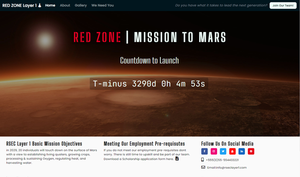
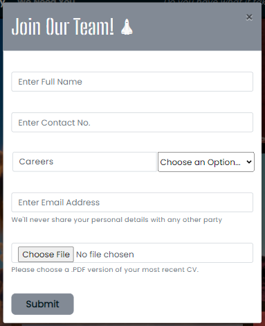

Red Zone Space Exploration Co. | Mission 2 Mars 

My Milestone Project was envisioned and created based on the knowledge gained from the course leading up to this point. As well as the course materials, there have been some additions which I have utilised. These additions have been highlighted and referenced later on in this document (references and credits section). 

View the live project here:[ RED ZONE M2M ](https://ferdosull.github.io/Milestone_Project_01/index.html)

For my first Milestone Project I am developing a futuristic recruitment type website for a fictional Space Exploration Company. The goal of the website is to inform potential candidates of the launch date for the first colony on Mars, what the pre-requisites are if they wish to apply to be part of the team, the type of candidate required (specialist skills and cross functional skills) and in the gallery section, display some photos and videos of previous missions to space. In the footer there is also the possibility to download a scholarship application form for students who may not currently meet the pre-requisite requirements. The website is made up of 4 pages including the main landing page. Please see detailed explanations below: 

**Main Page** 

The main page is very minimalistic. There is a large full screen high resolution image of Mars with the title “Red Zone Mission 2 Mars”. Immediately underneath the heading is a sub heading with the text “Countdown to Take Off” and immediately underneath this is a countdown timer with the end date of 05/01/2029 and beginning with the text “T-minus”.  This I feel keeps really in line with the Aerospace theme I am going for. Both the main heading and the subheading have a 2 second fade in which I feel displays well as the countdown timer takes a second or so to display while doing its calculation. At the top of the screen there is a navigation bar which links the user to the other 3 available pages. Also, in the nav bar is a signup style button titled “Join Our Team!” This is a chance for the user to submit their details and skillsets to be assessed for suitability before potentially joining the team. At the bottom of the page is a three-division footer which details some about text, a Download application or scholarship form and links to social media related websites. 

**We Need You (Careers)** 

The “We Need You” page provides insights into the skillsets that are required by the company for the layer 1 landing and a case study is provided for each sector. The sectors are divided into the following groupings of skillsets: Medical, Scientific, Military, Engineering, IT and Agricultural.  

To the right of each case study is a “Join Our Team” button if the user feels that they hit the target requirements for that section, they press this button and a user input form pops up. The input fields will be already be populated for the sector they are applying for. 

The Header and Footer remain the same for this page also. 

**About us** 

This page displays the company logo in the top left. The CEO’s picture in the top right and underneath, a small write up on the CEO’s previous accomplishments plus the amount of time they are active with The Red Zone Space Exploration Co.  

The middle column of the page contains a writeup on the company spanning how their existence came to be, right up to how the current mission received funding and was made possible. There are references to other Aerospace companies here with “Click Here” links to their home pages.  

The Header and Footer remain the same for this page also. 

**Gallery Page** 

The Gallery page contains photos and videos of successful missions and space machinery utilised in previous missions. 

The Header and Footer remain the same for this page also. 

**Utilising the 5 Planes of UX Design** 

**The Strategy Plane** 

The strategy plane, as mentioned previously, is concerned with trying to attract professionals on behalf of RSEC (Red Zone Space Exploration Co.) within the Aerospace industry to sign up for the first colony the live on Mars. I aim to achieve this by promoting the company in the about section, providing example skillsets case studies and having quotes from current employees who are preparing for the mission also. Previous mission pictures can be viewed in the gallery section also. 

**The Scope Plane** 

To Be Completed yet. 

**The Structure Plane** 

The website will consist of 4 pages, each with heading and footer continuity throughout.  The 4 pages are: 

A “Main” page, an “About Us” page, A “We Need You Page” and a “Picture Gallery” page. 

There is room to improve with additions but with the time that was allowed I am quite happy with the result. Based on what we have covered in the course work you could say that the project is in an “MVP” state. 

The navigation bar will be at the top of all pages and have a dark background. The Bootstrap class “navbar-dark” is being utilised here. 

Links will change style on hover as is standard with the bootstrap navbar class. This subtle animation lets the user know that they can click it to navigate to the location described by text or for more content. 

The links that lead to external content like the application form and social media pages will open on a new tab.  The user will not lose the page that they were on before clicking the link. 

**The Skeleton Plane** 

To Be Completed yet. 

**The Surface Plane** 

My inspiration for the overall look and feel of the project comes from various Sci-Fi outlets (films/games) but the main colour scheme is based around the colour red as in “Mars the Red Planet”. 

` `The initial red and rest of the palette colour scheme was derived with[ www.coolors.com ](http://www.coolors.com/)

The Red I chose (#A72608) I felt was easy on the eye and not too bright or too dark. The rest of the palette was derived and locked in based on accenting and I feel the colours chosen work well with each other. The black and darker colours may not seem like a good choice but I feel they represent space very well and during my research it was noted that a lot of space related websites do also utilise black a lot, most notably:[ www.nasa.gov ](http://www.nasa.gov/)

Hovering over links, or on the application form, causes the buttons or icons to change colour alerting the user to the presence of their mouse pointer. For the social media icons, I used a grey colour for when not active. Once the mouse pointer hovers over the icon the background colour changes to that of the colour associated with the social media outlet. 

**Typography** 

The fonts used for the milestone project are: “Poppins”, “Big Shoulders Stencil Text” and “Jet Brains Mono”. 

All three fonts were located and used from the website:[ https://fonts.google.com/ ](https://fonts.google.com/)

They appear futuristic and I feel that they fit in well with the space theme I am going for. I don’t think they would look out of place as a decal or a logo on the side of a space shuttle. Throughout the project I have made subtle changes to the font sizes and spacings as can be seen in the style.css sheet. 

**User stories** 

**External user’s goal:** 

The site's users are academic professionals and students between the ages of 18 and 30, who wish to be part of the first colony on Mars. 

**Site owner's goal:** 

The Red Zone Space Exploration Company are interested in finding the right individuals who will be capable of providing and sustaining an environment on Mars to ensure survival of the human race. Not an easy task. 

**First Time User Goals** 

As a First Time User, I want to understand the missions objectives and see does my skillsets fit the Red Zone Space Exploration Co.’s pre-requisites. 

As a First Time User, I want to understand what the company is looking for and apply for a scholarship  

As a First Time User, I want to find out when exactly the launch date for this mission is and what missions the company have successfully completed previously. 

**Returning User Goals**  

- As a Returning User, I want to log in and see how my assessment is progressing. Have I been successful with my application. 
- As a Returning User, I want to find contact info so that I can call or email the company directly. 

**Frequent User Goals**  

- As a Returning User, I want to log in and see how my assessment is progressing. Have I been successful with my application. 
- As a Frequent User, I want to view information on how the mission preparation is progressing. 
- As a Frequent User, I want to call or email the company directly. 

**Design** 

For this project I decided to use a 4-page structure. The main page, the careers page, the about page and the gallery page.  

To Be Completed yet. 

**References and Credits Section** 

**Code:** 

The code for the countdown timer on the main page was found in the following location: [https://www.w3schools.com/howto/howto_js_countdown.asp ](https://www.w3schools.com/howto/howto_js_countdown.asp)

The countdown timer was further styled to include a custom font and font size plus an opaque background. 

The code for how to display text on a picture was found in the following location: [https://www.w3schools.com/howto/howto_css_image_text.asp ](https://www.w3schools.com/howto/howto_css_image_text.asp)

**Media: (Photos/Videos)** 

The photos used to create the gallery were taken from the following location: [https://unsplash.com/ ](https://unsplash.com/)

Please see list of credits below for each photo: 

bill-jelen-xb58P14hThc-unsplash – Photo by Bill Jellen brian-mcgowan-5\_Z3YVosrCw-unsplash – Photo by Brian McGowan chris-boyer-S5c8MV04URs-unsplash – Photo by Chris Boyer david-von-diemar-OIK7ce6mOW0-unsplash – Photo by David von Diemar joshua-hoehne-WeSWsnVQYqU-unsplash – Photo by Joshua Hoehne juli-kosolapova-pZ-XFIrJMtE-unsplash – Photo by Juli Kosolapova laurel-and-michael-evans-DsC24AEuYjc-unsplash – Photo by Laurel and Michael Evans margaux-olverd-5MSDShQyYSg-unsplash – Photo by Margaux-Olverd nicolas-lobos-NR\_tXTuyTak-unsplash – Photo by Nicolas Lobos terence-burke-WV7ZMt3RjsQ-unsplash – Photo by Terence Burke 

**Fictional Application Form-PDF:** 

The fictional application form was found at the following location: [https://www.sampleforms.com/scholarship-application-form.html ](https://www.sampleforms.com/scholarship-application-form.html)

**Creation of Template and Deployment of this Project (GitHub & GitPod)** 

**Creating a new project** 

Once logged in to GitHub I created my project by clicking on the “New” repository button in the top left of the screen. 

After clicking on the “New” button I was navigated to the “Create New Repository Page” [https://github.com/new ](https://github.com/new). I selected Code Institutes full template and checked the box to include all branches. I gave the Repository a name “Milestone\_Project\_01” and a description “Red Zone Space Exploration Co. Recruitment Website”. I left the repository set to “Public” and pressed the “Create Repository” button. Please see below: 

After the repository was created I navigated to it [repository] [https://github.com/Ferdosull/Milestone_Project_01 ](https://github.com/Ferdosull/Milestone_Project_01). I then clicked the “GitPod” green button which created my new workspace for the project based on the template chosen. All additions and changes made to complete this project were done in this workspace and some offline in Notepad ++, then uploaded.  

**I utilised the following commands throughout the project after changes:** 

“git add . “: This command is used to add all edited files to the staging area before carrying out a commit. 

“git commit -m \*commit message summarising the updates\*”: This command is used to commit the changes made to any files which had been previously added with “git add”. 

“git push”: This command is used to push git commit changes to the GitHub hosting pages so that they can be viewed on a browser.  

**How to deploy my Milestone\_Project\_01 on GitHub Pages** 

1. Navigate to the GitHub [Repository:][ https://github.com/Ferdosull/Milestone_Project_01 ](https://github.com/Ferdosull/Milestone_Project_01)
1. Click on the 'Settings' Tab highlighted in the following screenshot. 

3. Scroll Down to the GitHub Pages section and select “Master” from the first drop down menu and click the “Save” button. Please see below: 

4. Once the project has been published, navigate back down to the GitHub Pages section and click on the link provided to navigate to live deployed site. Please see below: 

**How to Download, View and Edit this project Locally using Notepad++** 

1. Navigate to the GitHub [Repository:][ https://github.com/Ferdosull/Milestone_Project_01 ](https://github.com/Ferdosull/Milestone_Project_01)
1. Click on the “Code” drop down menu beside the “Gitpod” button. Please see below: 

3. From the drop-down menu, select “Download ZIP”. After the file folder has downloaded, navigate to your PCs “Downloads” folder, then cut and paste the Zip file into a location where you are comfortable to unpack it. I have created a folder on my desktop called “Code-Institute-Projects”. 

4. Once you have successfully unpacked the Zip file, navigate to the index.html file and double click it to browse the project locally. It will load in your default browser. As can be seen from the screenshot below, my default browser is Google Chrome: 

4. If you wish to edit the index.html file or the style.css file located in the “assets” folder, you need to right click on the file you wish to edit and open with Notepad++. 

5. Once opened in the Notepadd++ editor you can make changes to html and css files, save the changes and re-open or refresh your browser to see the impact. 

**Acknowledgements**

To Be Completed yet.
