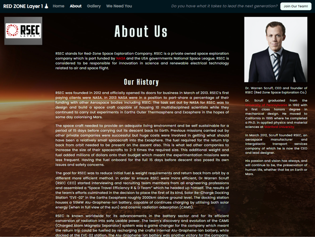

# Milestone Project 01 

### Red Zone | Mission to Mars  

## Table of contents
1. [Introduction](#intro)
2. [Responsive Design](#responsive_design)
3. [My Project Description and Design](#project_description)
    1. [Main Page](#main_page)
    2. [We Need You](#we_need_you)
    3. [About Us](#about_us)
    4. [Gallery](#gallery)
    5. [Nav-Bar](#nav-bar)
    6. [Join Our Team](#join_our_team)
    7. [Footer](#footer)
4. [Utilising the 5 Planes of UX Design](#ux_design)
    1. [The Strategy Plane](#strategy_plane)
    2. [The Scope Plane](#scope_plane)
    3. [The Structure Plane](#structure_plane)
    4. [The Skeleton Plane](#skeleton_plane)
    5. [The Surface Plane](#surface_plane)
5. [Typography](#typography)
6. [User Stories](#user_stories)
    1. [External User's Goal](#external_user_goal)
    2. [Site Owner's Goal](#site_owner_goal)
    3. [First Time User Goals](#first_time_user_goals)
    4. [Returning User Goals](#returning_user_goals)
    5. [Frequent User Goals](#frequent_user_goals)
7. [References and Credits Section](#references_and_credits)
    1. [Code](#code)
    2. [Media](#media)
    3. [Fictional Application Form](#fictional_application_form)
    4. [Contact](#contact)
8. [Testing](#testing)
    1. [Website Responsiveness and Call to Action Functionality Testing Procedure](#testing_procedure)
    2. [HTML and CSS Validation](#validation)
9. [Future "Nice to Have" Additions to The Website](#additions)
10. [Creation of Template and Deployment of Project](#project_deployment)
    1. [Creating a New Project](#new_project)
    2. [Commands Utilised Throughout The Project After Changes](#commands)
    3. [How to Deploy My Milestone\_Project\_01 on GitHub Pages](#how_to_deploy)
    4. [How to Download, View and Edit This Project Locally using Notepad++](#how_to_download)
11. [Acknowledgements](#acknowledgements)  

## Introduction 

My Milestone Project was envisioned by me and created based on the knowledge gained so far from this course. 
I have taken the fundamentals that I have learned from the course and applied them to this website with style changes to suit my application. 
As well as the course materials, there have been some additions which I have found online and utilised. 
These additions have been highlighted and referenced later on in this document (references and credits section).
 
## Responsive Design 

As seen in the three pictures below, both "Min" and "Max" media queries were used to ensure all 4 pages of the website were responsive across Desktop and Mobile devices.

View the live project here:[ RED ZONE M2M ](https://ferdosull.github.io/Milestone_Project_01/index.html)  

## My Project Description and Design 

The RSEC website is made up of a main landing page and three further information and data submission pages. 
Please see initial envisioned wireframes (before project start) and actual screenshots of the finished website for all pages in the next four sections below:
  

### Main Page 
**Click Here!**[ index.html](https://ferdosull.github.io/Milestone_Project_01/index.html) To Visit The Main Page

The main page is very minimalistic. At the top of the page is a full width Nav-Bar which is shared on all pages. The Nav-Bar will be detailed at the end of this section. 
There is a large full screen high resolution image of Mars with the title “RED ZONE | MISSION TO MARS”. 
Immediately underneath the heading is a sub heading with the text “Countdown to Take Off” and immediately underneath this is a countdown timer 
with the end date of 05/01/2029 and beginning with the text “T-minus”. This I feel keeps the main page really in line with the Aerospace theme I am going for. 
Both the main heading and the sub-heading have a 2 second fade-in which I feel displays well as the countdown timer takes a second or so to display while doing its calculation. 
At the bottom of the page is a three-division footer which details some "About" text, a download application, or scholarship form and links to social media related websites. 
The Footer will also be detailed at the end of this section. 
  

### We Need You (Careers) 
**Click Here!**[ weneedyou.html](https://ferdosull.github.io/Milestone_Project_01/weneedyou.html) To Visit The We Need You Page

The “We Need You” page provides insights into the four sectors that require additional engineering staff in preparation for the mission launch in 2029. 
The sectors are divided into the following groupings of skillets: Advanced Medical, Information Technology, Agricultural Science and Engineering Science. 

In desktop format, if the pictures are hovered over, a description of the image can be seen with white text on an opaque background. On mobile, 
the same text description is always present. This was achieved by using “Min” & “Max” width, & “Min” & “Max” height media queries as learned on the course. 
Clicking on the image on both desktop and mobile will open the image in its own browser page. 

To the right of each sector description is a “Join Our Team” button for the user to click/press if they feel that they hit the target requirements for that sector. 
When they press this button a user input form (modal) pops up. The dropdown input field will be already be populated for the sector that the candidate is applying for. 

The Nav-Bar and Footer here are identical to the main page also. 
  

### About us 
**Click Here!**[ about.html](https://ferdosull.github.io/Milestone_Project_01/about.html) To Visit The About Page

  

The “About Us” page displays the company logo in the top left column. The company logo was created using a free logo creator on the following website
:[ Brand Crowd ](https://www.brandcrowd.com/maker/tag/free?code=25offsem&sem_ab=true&gclid=CjwKCAiArbv_BRA8EiwAYGs23IQTzXxcSC2m5vKdu3MSsOoz-ec-edyJeESBas_P0vYz0VGaT-PpGRoCqLcQAvD_BwE)

The image was styled further and resized by me using Photoshop. 

The CEO’s picture was taken from[ UnSplash ](https://unsplash.com/)and is placed in the top right corner, and directly underneath it is a small write up on the 
CEO’s previous accomplishments, plus the amount of time they are active with The Red Zone Space Exploration Co. The picture used for the CEO is credited to the 
photographer in the credits section. In the write-up underneath the CEO’s picture are two “red” links navigating the user to the home pages of both Universities that the 
CEO previously studied at. These web links are opened in a new browser tab. 

The middle column of the page contains a writeup on the company, spanning how their existence came to be, right up to how the current mission received funding 
and was made possible. This is broken down into three sections after the initial introduction: 1. Our History, 2. Our Future and 3. Prerequisites. There is a reference 
to one other Aerospace company (NASA) throughout the middle column. The first reference also has “red” links taking you to NASA's home page in a new browser tab. 
At the end of the "Prerequisites" section there is a "red" text link to the "We Need You" page which is internal and opens in the same tab. 

The Nav-Bar and Footer here are identical to the main page also. 
  

### Gallery 
**Click Here!**[ gallery.html](https://ferdosull.github.io/Milestone_Project_01/gallery.html) To Visit The Gallery Page

  
The Gallery page contains photos of the RSEC catalogue which documents RSEC space machinery, testing phases, prototypes, experiments and shuttle launches. 
By clicking on each picture it will load it in its own browser tab. Again, keeping in line with the same style as the “We Need You Page”, in desktop format, 
if the pictures are hovered over, a description of the image can be seen with white text on an opaque background. Also, when the picture is hovered over, 
an "Open in New Tab" icon is also displayed in the top right corner. On mobile, the same text description and icon is always present. This was achieved by using 
“Min” & “Max” width, & “Min” & “Max” height media queries as learned on the course.  

The Nav-Bar and Footer here are identical to the main page also. 

### Nav-Bar 

The Nav-Bar is responsive and transforms at three different stages. The large size (desktop) sees the Nav-Bar stretch the full browser width. 
The medium size (small laptop / Tablet) sees the question to the left of the "Join Our Team!" button disapear. The small size (mobile device / phone) sees 
all items of the Nav-Bar transition into the drop-down style hamburger menu. Please see picture below which illustrates these transitions.

  

### Join Our Team Modal 

The "Join Our Team" Modal is responsive also across all platforms. It appears the same on large and medium devices but shrinks to fill the width 
of small mobile devices. The Submit button also becomes larger on small mobile devices. The modals entry areas have specific requirements to be fulfilled 
or else clicking/pressing "Submit" can return a fault message specific to the text or number box that was not populated, or incorrectly filled out. 
There is an option in the "Careers" dropdown box to select the employment area you are interested in. If the "Join Our Team" button is selected from 
the Nav-Bar then the dropdown displays the default of "Choose an Option..". If in the "We Need You" page and any of the "Join Our Team" buttons associated 
with the employment area on its left is selected, the dropdown box is already populated with that section for ease of use and good user experience. 
The modal also contains an option to select a file from your PC or Mobile device to be uploaded. For this particular situation, with the use of muted text, 
I have requested a .pdf version of the user's CV be submitted.

  

### Footer 

The Footer is separated into three equal width columns. The left column has a heading with paragraph text detailing some information about the upcoming mission. 
The middle column has a heading with paragraph text discussing scholarship options for a candidate if they do not meet the company's prerequisites. 
There is a responsive download icon which opens a sample application form pdf in a new tab which is downloadable. The column to the right contains a heading 
and eight responsive items. six of the responsive items are social media links which navigate the user to a new tab for the media outlet selected when clicked 
or pressed. Underneath the social media icons are a phone contact number and an email address link which are also  clickable/pressable. 
Clicking/pressing the phone number link auto populates the same number to call on a mobile phone device. Additional options are given on a desktop device. 
Clicking/pressing the email link auto populates the users default email client with "info@rseclayer1.com" in the "To" section and "General Question" in the "Subject" section of the email form. 
Please see the image below depicting the responsive footer before and after hovering on all icons and links.

To ensure I utilised the correct icon colours for each of the social media outlets in the footer I navigated to their official brand media pages 
and used a HTML colour picker to select the correct colour. 
Please see the image below of the colours picked for each icon using the following HTML colour picker: https://imagecolorpicker.com/en/

  

## Utilising the 5 Planes of UX Design 

**The Strategy Plane** 

The strategy plane is concerned with trying to attract professionals and students on behalf of RSEC (Red Zone Space Exploration Co.) 
within the Aerospace industry to sign up for the first colony the live on Mars. I aim to achieve this by promoting the company in the about section by discussing historical accolades, 
providing four employment sectors to choose from and some information about those sectors in the "We Need You" section. RSEC catelogue pictures can be viewed in the gallery section also. 
I have also provided a link to a downloadable Scholarship application form in the footer section.

**The Scope Plane** 

The first feature to be encountered by the user is the countdown timer on the main page. 
This countdown timer is calculated based on the point in time when the user visits the main page and the missions launch date (5th of Jan 2029). 
I feel this feature gives the user a defined sense of what is going to happen and when. It is my hope that it will intrigue them to look further.
In order to meet the stakeholders requirements, I feel the website will require an "About Us" section to build a confident background for the RSEC Company. 
The company will also require a "We Need You" section to explain the sector that is advertising employment and allow for candidates to apply.
For the "About Us" and the "We Need You" sections I will have to do some research and I plan to base the fictitious information on true space industry facts  
from established Aerospace Companies. If this were a real life scenario I would be requesting this information from the company, creating a Mark1 and looking for 
feedback before tailoring to suit their needs. A "Gallery" section I feel will also be required to convey success in the past. 

**The Structure Plane** 

The website will consist of four pages, each with a header and footer throughout.  The four pages are: 

A “Main” page, an “About Us” page, A “We Need You Page” and a “Picture Gallery” page. 

There is always room to improve with additions but with the time that was allowed I am quite happy with the result. 
The navigation bar will be at the top of all pages and have a dark background. 
The Bootstrap class “navbar-dark” is being utilised here. Each of the four pages can be navigated to from the Nav-Bar by clicking/pressing the appropriate text link. 
Links will change style on hover as is standard with the bootstrap navbar class. 
This subtle animation lets the user know that they can click it to navigate to the location described by text or for more content. 
The links that lead to external content like the application form and social media pages will open on a new tab. 
The user will not lose the page that they were on before clicking the link. 

**The Skeleton Plane** 

All four pages will have a consistent background image, use of [colours](#colours), [fonts](#typography) and responsive elements. 
Careful consideration was given to make the content well placed, clear and well presented. 
In order to try and capture the “Space” element I have chosen to refrain from clutter on the main page and have gone for a minimal approach. 
This leaves the background image of Mars as a stand out feature here. Please click on the following links to see pictures of the initially envisioned wireframes for the project: 

* [INDEX](#index-ux)

* [WE NEED YOU](#we-need-you-ux)

* [ABOUT](#about-ux)

* [GALLERY](#gallery-ux)

**The Surface Plane** 

My inspiration for the overall look and feel of the project comes from various Sci-Fi outlets (films/games) but the main colour scheme is based around the colour red 
as in “Mars the Red Planet”. 

The initial red and rest of the palette colour scheme was derived with[ www.coolors.com ](http://www.coolors.com/)

The Red I chose (#A72608) I felt was easy on the eye and not too bright or too dark. (!Update! the Red colour #A72608 has been changed to #E60023 for clarity reasons) 
The rest of the palette was derived and locked in based on accenting and I feel the colours chosen work well with each other. 
The black and darker colours may not seem like a good choice but I feel they represent space very well and during my research it was noted that 
a lot of space related websites do also utilise black a lot, most notably:[ www.nasa.gov ](http://www.nasa.gov/)

Hovering over links, or on the application form, causes the buttons or icons to change colour alerting the user to the presence of their mouse pointer. 
For the social media icons, I utilised the official brand media colours. Once the mouse pointer hovers over the icon the background colour changes from 
the colour associated with the social media outlet, to light grey. 
  

## Typography 

The fonts used for the milestone project are: “Poppins”, “Big Shoulders Stencil Text” and “Jet Brains Mono”. 

All three fonts were located and used from the website:[ https://fonts.google.com/ ](https://fonts.google.com/)

They appear futuristic and I feel that they fit in well with the space theme I am going for. I don’t think they would look out of place as a decal or a logo on the side 
of a space shuttle. Throughout the project I have made subtle changes to the font sizes and spacings for responsiveness as can be seen in the style.css sheet. 
  

## User stories 

**External user’s goal:** 

The site's users are academic professionals and students between the ages of 18 and 30, who wish to be part of the first colony on Mars. 
They will achive this either by direct employment or scholarship. 

**Site owner's goal:** 

The Red Zone Space Exploration Company are interested in finding the right individuals who will be capable of providing and sustaining an environment 
on Mars to ensure survival of the human race. Not an easy task. 

**First Time User Goals** 

- As a First Time User, I want to know when the launch date is for the Layer 1 mission. 
- As a First Time User, I want to read information about the company's previous accolades and understand their purpose.
- As a First Time User, I want to understand the missions objectives and see does my skillsets fit the Red Zone Space Exploration Co.’s pre-requisites. 
- As a First Time User, I want to see pictures of the RSEC catelogue, machinery, shuttles and astronauts in space.
- As a First Time User, I want to understand what type of candidate the company is looking for and apply for a scholarship.   

**Returning User Goals** 

- As a Returning User, I want to know when the launch date is again for the Layer 1 mission. 
- As a Returning User, I want to look at the photo gallery again. 
- As a Returning User, I want to re-submit my application with an updated CV.
- As a Returning User, I want to find contact info so that I can call or email the company directly. 

**Frequent User Goals** 

- As a Frequent User, I want to know when the launch date is again for the Layer 1 mission. 
- As a Frequent User, I want to view information on what sectors are currently hiring. 
- As a Frequent User, I want to call or email the company directly. 
  

## References and Credits Section   

**Code:** 

The code for the countdown timer on the main page was found at the following 
location[:https://www.w3schools.com/howto/howto_js_countdown.asp ](https://www.w3schools.com/howto/howto_js_countdown.asp)

  

Bootstrap Scripts and Stylesheets were utilised on this project:[ Bootstrap CSS](https://stackpath.bootstrapcdn.com/bootstrap/4.3.1/css/bootstrap.min.css) 
[ Bootstrap Script](https://stackpath.bootstrapcdn.com/bootstrap/4.3.1/js/bootstrap.min.js) 

Fontawesome Stylesheets were utilised on this project:[ Fontawesome](https://use.fontawesome.com/releases/v5.6.1/css/all.css)

Google fonts Stylesheets were utilised on this project:[ Google Fonts](https://fonts.googleapis.com/css2?)
  

**Media** 

The photos used to create the gallery were taken from the following location: [https://unsplash.com/ ](https://unsplash.com/)

Please see list of credits below for the owner of each photo: 

* bill-jelen-xb58P14hThc-unsplash – Photo by[ Bill Jelen ](https://unsplash.com/@billjelen?utm_source=unsplash&utm_medium=referral&utm_content=creditCopyText)on[ Unsplash ](https://unsplash.com/s/photos/space-shuttle?utm_source=unsplash&utm_medium=referral&utm_content=creditCopyText)

* brian-mcgowan-5\_Z3YVosrCw-unsplash – Photo by[ Brian McGowan ](https://unsplash.com/@sushioutlaw?utm_source=unsplash&utm_medium=referral&utm_content=creditCopyText)on[ Unsplash ](https://unsplash.com/s/photos/mars?utm_source=unsplash&utm_medium=referral&utm_content=creditCopyText)

* chris-boyer-S5c8MV04URs-unsplash – Photo by[ Chris Boyer ](https://unsplash.com/@csgboyer?utm_source=unsplash&utm_medium=referral&utm_content=creditCopyText)on[ Unsplash ](https://unsplash.com/s/photos/mars?utm_source=unsplash&utm_medium=referral&utm_content=creditCopyText)

* david-von-diemar-OIK7ce6mOW0-unsplash – Photo by[ David von Diemar ](https://unsplash.com/@davidvondiemar?utm_source=unsplash&utm_medium=referral&utm_content=creditCopyText)on[ Unsplash ](https://unsplash.com/s/photos/mars?utm_source=unsplash&utm_medium=referral&utm_content=creditCopyText)

* joshua-hoehne-WeSWsnVQYqU-unsplash – Photo by[ Joshua Hoehne ](https://unsplash.com/@mrthetrain?utm_source=unsplash&utm_medium=referral&utm_content=creditCopyText)on[ Unsplash ](https://unsplash.com/s/photos/mars?utm_source=unsplash&utm_medium=referral&utm_content=creditCopyText)

* juli-kosolapova-pZ-XFIrJMtE-unsplash – Photo by[ JuliKosolapova ](https://unsplash.com/@yuli_superson?utm_source=unsplash&utm_medium=referral&utm_content=creditCopyText)on[ Unsplash ](https://unsplash.com/s/photos/mars?utm_source=unsplash&utm_medium=referral&utm_content=creditCopyText)

* laurel-and-michael-evans-DsC24AEuYjc-unsplash – Photo by[ Laurel and Michael Evans ](https://unsplash.com/@laurelmike?utm_source=unsplash&utm_medium=referral&utm_content=creditCopyText)on[ Unsplash ](https://unsplash.com/s/photos/mars?utm_source=unsplash&utm_medium=referral&utm_content=creditCopyText)

* margaux-olverd-5MSDShQyYSg-unsplash – Photo by[ Margaux Olverd ](https://unsplash.com/@margaux_unsplash?utm_source=unsplash&utm_medium=referral&utm_content=creditCopyText)on[ Unsplash ](https://unsplash.com/s/photos/mars?utm_source=unsplash&utm_medium=referral&utm_content=creditCopyText)

* nicolas-lobos-NR\_tXTuyTak-unsplash – Photo by[ Nicolas Lobos ](https://unsplash.com/@lobosnico?utm_source=unsplash&utm_medium=referral&utm_content=creditCopyText)on[ Unsplash ](https://unsplash.com/s/photos/mars?utm_source=unsplash&utm_medium=referral&utm_content=creditCopyText)

* terence-burke-WV7ZMt3RjsQ-unsplash – Photo by[ Terence Burke ](https://unsplash.com/@ancientwanderer?utm_source=unsplash&utm_medium=referral&utm_content=creditCopyText)on[ Unsplash ](https://unsplash.com/s/photos/space-shuttle?utm_source=unsplash&utm_medium=referral&utm_content=creditCopyText)

* steffen-wienberg-ml-pxK0Ovmw-unsplash – Photo by[ steffenWienberg ](https://unsplash.com/@wnbrg?utm_source=unsplash&utm_medium=referral&utm_content=creditCopyText)on[ Unsplash ](https://unsplash.com/s/photos/older-male-portrait-colour-suit?utm_source=unsplash&utm_medium=referral&utm_content=creditCopyText)

* imgix-klWUhr-wPJ8-unsplash – Photo by[ imgix ](https://unsplash.com/@imgix?utm_source=unsplash&utm_medium=referral&utm_content=creditCopyText)on[ Unsplash ](https://unsplash.com/s/photos/computers-information-technology-coding?utm_source=unsplash&utm_medium=referral&utm_content=creditCopyText)

* science-in-hd-4pM4nhHyo9M-unsplash – Photo by[ Science in HD ](https://unsplash.com/@scienceinhd?utm_source=unsplash&utm_medium=referral&utm_content=creditCopyText)on[ Unsplash ](https://unsplash.com/s/photos/advanced-medical-lab?utm_source=unsplash&utm_medium=referral&utm_content=creditCopyText)

* roman-synkevych-fjj7lVpCxRE-unsplash – Photo by[ Roman Synkevych ](https://unsplash.com/@synkevych?utm_source=unsplash&utm_medium=referral&utm_content=creditCopyText)on[ Unsplash ](https://unsplash.com/s/photos/agriculture?utm_source=unsplash&utm_medium=referral&utm_content=creditCopyText)

* thisisengineering-raeng-Bt9HIKC0Nus-unsplash – Photo by[ ThisisEngineeringRAEng ](https://unsplash.com/@thisisengineering?utm_source=unsplash&utm_medium=referral&utm_content=creditCopyText)on[ Unsplash ](https://unsplash.com/s/photos/engineering-space?utm_source=unsplash&utm_medium=referral&utm_content=creditCopyText)

I’d like to say thank you to the photographers who provided the content above via Unsplash free of charge. 
  

The Logo for the “About Section” was created using the free online logo creator located at: [https://looka.com/explore ](https://looka.com/explore)
  

**Fictional Application Form-PDF:** 

The fictional application form was found at the following location: [https://www.sampleforms.com/scholarship-application-form.html ](https://www.sampleforms.com/scholarship-application-form.html)
  

**Content:** 

The content for this site is completely fictional but created by me based on my understandings of engineering and the space industry. 

For additional info regarding the different sectors that the RSEC Company wish to hire candidates for, 
I consulted and augmented some online article information from the following websites: 

[https://www.sciencenews.org/article/mars-farming-harder-martian-regolith-soil ](https://www.sciencenews.org/article/mars-farming-harder-martian-regolith-soil)

[https://www.nasa.gov/centers/ames/research/humaninspace/humansinspace- informationtechnology.html ](https://www.nasa.gov/centers/ames/research/humaninspace/humansinspace-informationtechnology.html)

[https://www.esa.int/Enabling_Support/Space_Engineering_Technology/Engineering_for_space ](https://www.esa.int/Enabling_Support/Space_Engineering_Technology/Engineering_for_space)

[https://www.esa.int/About_Us/EAC/Space_Medicine ](https://www.esa.int/About_Us/EAC/Space_Medicine)
  

## Testing 

**Website Responsiveness and Call to Action Functionality Testing Procedure** 

For the testing of all four website pages I have utilised the following web browsers: Microsoft Edge, Mozilla Firefox and Google Chrome.

To carry out testing on mobile devices I have used Google Chrome inspect tools on my desktop PC as well as Safari on my IPad and IPhone.

Please see the testing procedure I have created for the "Red Zone | Mission To Mars" website below:
  

### Nav-Bar (all pages)

* Check that the current page visited is "Active" on the top left of the Nav-Bar. It will be highlighted by the colour white.
* Check hovering over each of the page navigation items and the "Join Our Team!" button. The active page will not change when hovered over. This is to signify the users current location.
* Check that clicking/pressing each link in the top left of the Nav-Bar navigates you to the correct page. "Home" > index.html, "About" > about.html, "Gallery" > gallery.html, "We Need You" > weneedyou.html
* Check that when navigated to a page from the Nav-Bar that it opens in the same tab, not an external tab.
* Check that the question text, "Do you have what it takes to lead the next generation?", disappears when on medium sized mobile devices or small laptop screens.
* Check that when the "Join Our Team" button (text in hamburger menu) is clicked/pressed it opens up the join our team modal.
* Check that on mobile devices all items, except the question text, transition into the hamburger style dropdown menu.
* Check that all items within the hamburger style dropdown menu function no differently than how they are mentioned previously in desktop format.
  

### Footer (all pages)

* Check the footers responsiveness when transitioned between desktop, medium sized mobile devices and small mobile phone devices.
* Check hovering over the download scholarship icon, the social media icons, the contact telephone number and the email link.
* Check that clicking/pressing the download scholarship icon opens a sample pdf application form in its own tab, which is downloadable.
* Check that clicking/pressing the social media icons navigates you to the social media outlets main page in its own tab.
* Check that clicking/pressing the contact number auto populates mobile devices with the number onscreen for making a call. If clicked/pressed on a desktop device it asks the user if they wish to send the number from the browser to a mobile phone.
* Check that clicking/pressing the email link causes the users default email client to open up and auto populate the "To" section with the email address: info@rseclayer1.com and the subject section with "General Question".
  

### Modal (all pages)

* Check that the modal is responsive across all platforms. On small mobile devices the modal shrinks to fit the size of the device window in portrait mode and the "Submit" button becomes larger.
* Check that all form areas are present: 1. Enter Full Name, 2. Enter Contact No., 3. Careers drop down menu, 4. Enter Email Address, 5. Choose a file for upload, 6. Submit Button.
* Check hovering on the "Submit" button.
* Check that the three entry boxes (Enter Name, Enter Contact No. and Enter Email Address) give back an error message when "Submit" is clicked/pressed if they are not populated or incorrectly populated.
* Check that the dropdown menu contains the following options as well as the default "Choose an Option..": Advanced Medical, Information Tech., Agriculture Science, Engineering Science.
* When checking the modal in the "We Need You" page, the "Join Our Team" button associated with the individual employment sector will open a modal with the area of interest already populated in the dropdown menu. This needs to be checked for each sector.
* Check that the "Choose File" for upload allows you to select a file on both desktop and mobile devices. Once the file is selected it's name and file extension should be reflected in the text box to the right of the "Choose File" button.
  

### Main Page

* Check that the background image loads as it should and is responsive when transitioned across all platforms.
* Check that the "Red Zone" text appears in red and the rest of the text appears in white.
* Check that the countdown timer appears underneath the "countdown to launch" text and that all appears centered in the page and adequately spaced.
* Check that the fonts are correct for each heading/paragraph.
  

### About Page

* Check that the background image loads as it should and is responsive when transitioned across all platforms.
* Check that the unequal, three column format appears well on desktop followed by a transition to single column on medium and small mobile devices.
* Check hovering over all of the red link text in the paragraphs and the text under the CEO's Picture.
* Check that all text links navigate the user to the desired location, either within the same tab or in a new tab.
* Check that the fonts are correct for each heading/paragraph.
* Check that clicking on each of the two pictures (logo and CEO picture) will open them in a new tab.
  

### Gallery Page

* Check that the background image loads as it should and is responsive when transitioned across all platforms.
* Check that all RSEC images appear on desktop mode in a four column tiled wall effect.
* Check that all RSEC images when hovered over in desktop mode display a text description at the bottom and an "open in new tab" symbol on the top right.
* Check that when transitioned to smaller size laptops that the tile structure changes to 3 columns.
* Check that when transitioned to medium sized mobile device tablets that the tile structure changes to 2 columns.
* Check that when transitioned to small sized mobile device phones that the tile structure changes to 1 column.
* Check that when transitioned to medium and small sized mobile devices that the "new tab" icon and picture text overlays are present constantly.
* Check that all pictures when clicked/pressed will open in a new tab.
  

### We Need You Page

* Check that the background image loads as it should and is responsive when transitioned across all platforms.
* Check that the three column format appears well on desktop followed by a transition to single column on medium and small mobile devices.
* Check that all RSEC images when hovered over in desktop mode display a text description at the bottom.
* Check that the fonts are correct for each heading/paragraph.
* Check hovering over all of the text links in the paragraphs and the "Join Our Team" buttons.
* Check that when transitioned to medium and small sized mobile devices, that the picture text overlays are present constantly.
* Check that all text links navigate to the "Prerequisites" section of the "About" page within the same tab.
* Check that clicking on each of the four pictures will open them in a new tab.
  

### At all stages during testing, text was evaluated for spelling, grammer and punctuation.  

**HTML and CSS Validation** 

Testing Code Validators for all sections of the website were carried out at: 

HTML =[ https://validator.w3.org/ ](https://validator.w3.org/) and CSS =[ https://jigsaw.w3.org/css-validator/ ](https://jigsaw.w3.org/css-validator/)

Below are screenshots of the results of all four HTML pages and my CSS stylesheet. All Sections Passed:

### Index

### About

### Gallery

### We Need You

### CSS

  

## Future "Nice to Have" Additions to The Website 

If I could make further additions to the website down the line they would be to include the following:

 * A "Log In" section for returning users. This way the candidates could access information in relation to the processing of their application, 
 or make further submissions and add certificates and academic awards to build there overall application profile.

 * A "Live RSEC Progress Report". This would include milestones selected and hit and by the company enroute to the mission launch date. 
 The skills percentage completed section in the Code Institute "My-CV" website would be an ideal place to start and build on.
  

## Creation of Template and Deployment of this Project (GitHub &GitPod) 

**Creating a new project** 

Once logged into GitHub I created my project by clicking on the “New” repository button in the top left of the screen. 

After clicking on the “New” button I was navigated to the “Create New Repository Page” [https://github.com/new ](https://github.com/new). 
I selected Code Institutes full template and checked the box to include all branches. 
I gave the Repository a name “Milestone\_Project\_01” and a description “Red Zone Space Exploration Co. Recruitment Website”. 
I left the repository set to “Public” and pressed the “Create Repository” button. Please see below: 

After the repository was created I navigated to it [repository][https://github.com/Ferdosull/Milestone_Project_01.](https://github.com/Ferdosull/Milestone_Project_01) 
I then clicked the “GitPod” green button which created my new workspace for the project based on the template chosen. 
All additions and changes made to complete this project were carried out in this workspace with some initial works completed offline in Notepad ++, then copied up and committed.  

**Commands Utilised Throughout The Project After Changes:** 

“git add .“: This command is used to add all edited files to the staging area before carrying out a commit. 

“git commit -m \*commit message summarising the updates\*”: This command is used to commit the changes made to any files which had been previously added with “git add”. 

“git push”: This command is used to push git commit changes to the GitHub hosting pages so that they can be viewed on a browser.  

**How to Deploy My Milestone\_Project\_01 on GitHub Pages** 

1. Navigate to the GitHub [Repository:[\]https://github.com/Ferdosull/Milestone_Project_01 ](https://github.com/Ferdosull/Milestone_Project_01)**

2. Click on the 'Settings' Tab highlighted in the following screenshot.** 

3. Scroll Down to the GitHub Pages section and select “Master” from the first drop down menu and click the “Save” button. Please see below:** 

4. Once the project has been published, navigate back down to the GitHub Pages section and click on the link provided to navigate to live deployed site. Please see below:** 

**How to Download, View and Edit This Project Locally using Notepad++** 

1. Navigate to the GitHub [Repository:][ https://github.com/Ferdosull/Milestone_Project_01 ](https://github.com/Ferdosull/Milestone_Project_01)

2. Click on the “Code” drop down menu beside the “Gitpod” button. Please see below: 

3. From the drop-down menu, select “Download ZIP”. After the file folder has downloaded, navigate to your PCs “Downloads” folder, then cut and paste the Zip file into a 
location where you are comfortable to unpack it. I have created a folder on my desktop called “Code-Institute-Projects”. 

4. Once you have successfully unpacked the Zip file, navigate to the index.html file and double click it to browse the project locally. 
It will load in your default browser. As can be seen from the screenshot below, my default browser is Google Chrome: 

5. If you wish to edit the index.html file or the style.css file located in the “assets” folder, you need to right click on the file you wish to edit and 
open with Notepad++. 

6. Once opened in the Notepad++ editor you can make changes to the html and css files, save the changes and re-open or refresh your browser to see the impact. 

## Acknowledgements 

I'd like to say a special thank you to my mentor Allen Thomas Varghese for his excellent advice and recommendations throughout the project. 
